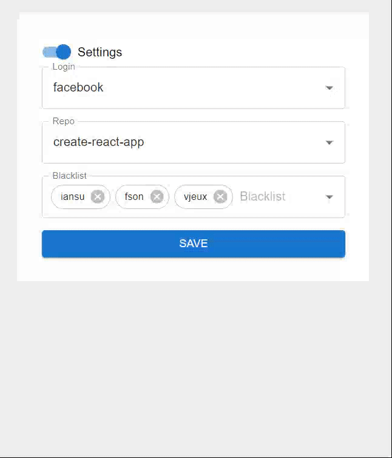

# React

Домашнее задание для "Школы программистов HeadHunter" (react/redux)

## Ссылка на GitHub Pages 🎨

[Ссылка](https://nikita160.github.io/react-hw/)

## Демо

## Функциональность

Одностраничное приложение, которое помогает найти ревьюера.

- кнопка настроек, по клику на нее можно переключать видимость настроек.
- в настройках 3 поля:
  - login для ввода логина текущего юзера
  - repo для указания репозитория для которого ищем ревьюера
  - blacklist для указания списка login-ов, кто не должен быть ревьюером
- состояние настроек сохранять в localStorage
- для генерации ревьюера нужна кнопка поиска ревьюера, по клику на которую должен быть выбран рандомный ревьюер из списка контрибьютеров репозитория указанный в пункте 2 настроек, учитывая blacklist пункта 3.
- при генерации ревьюера показываем текущего пользователя и перебираемые вами пользователи для ревью(выводим имя и аватар)
- асинхронные запросы выполняются через Middleware

## Стек

- HTML/CSS
- JavaScript
- React
- Redux
